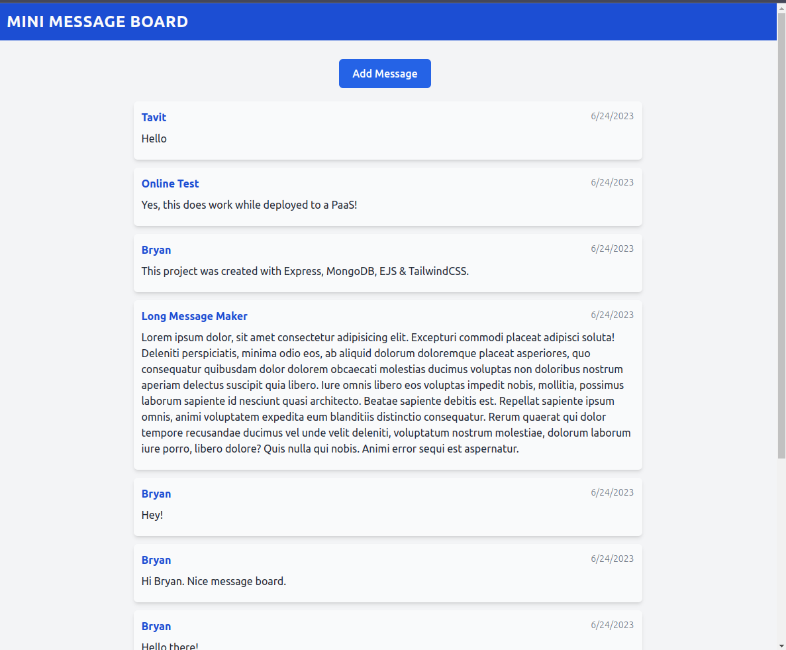
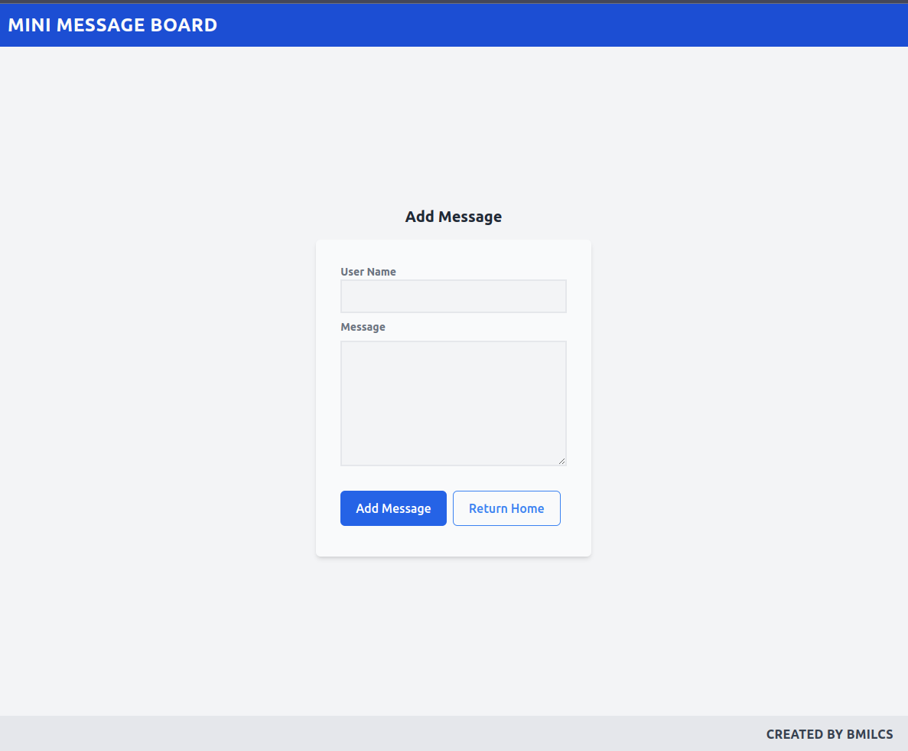

# Odin Project #26: Mini Message Board (Express, MongoDB)

Welcome to Bryan Miller's Mini Message Board, the [twenty sixth assignment](https://www.theodinproject.com/lessons/nodejs-mini-message-board) within the Odin Project curriculum. The goal of this repo is to practice the following skill sets:

- MVC
- Express
- MongoDB / Atlas
- Mongoose
- EJS
- TailwindCSS
- Fly.io PaaS

## Links

- [Live Demo](https://messageboard.bmilcs.com)
- [My Odin Project Progress](https://github.com/bmilcs/odin-project)

## Summary

The Mini Message Board project, as simple as it is, is a full stack web application that utilizes the MVC pattern. The backend is written in Express, a NodeJS framework, and it does the following:

- Listens for HTTP `GET` requests:

  - `/` Route retrieves messages from MongoDB and renders the `index` view (the message board)
  - `/new` Route renders the `form` view (add message form)
  - `/*` Route renders the `error` view (error page)

- Listens for HTTP `POST` requests on `/new` route:

  - Validates the form data sent via `req.body` (minimal validation)
  - If the data is valid, it creates a new `Message` model, saves the data to MongoDB & redirects the user to `/` index
  - If the data is invalid, it re-renders the `/form` & displays the user's previous form data for correction

To connect to MongoDB Atlas, I used the Mongoose ORM. Mongoose gives us the ability to define Schemas for the data in our models and makes interacting with the database a breeze.

I used EJS as my template engine, which allows us to write standard HTML with JavaScript sprinkled in via the following syntax:

```js
<p><%= someVariable %=></p>
```

For styling, I used TailwindCSS. Tailwind provides a robust set of utility classes for building out our CSS. The benefits of using this CSS framework are:

- It gives us the ability to customize a web site in an unopinionated way
- It frees us up from having to come up with naming conventions for classes
- It automatically removes unused properties during compilation and compresses your CSS for faster loading times

This project was deployed to the Fly.io PaaS (Platform as a Service). Their CLI utility made quick work of getting this project posted to the web. There were two issues that arouse during deployment:

1. Importing the `.env` file via the CLI did not work. Instead, I manually exported the MongoDB connection string via `fly secrets set MONGODB_URL=...`.
2. Fly.io does not give you a consistent outbound IP address for whitelisting in the MongoDB Atlas platform.

To get the project published to my custom domain, I did the following:

1. Added a certificate: `flyctl certs create messageboard.bmilcs.com`
1. Added a CNAME record to the DNS records

All in all, this was a great introduction to backend development. I look forward to learning more in the upcoming lessons.

## Screenshots




## Deployment

```sh
# clone repo & change directories
git clone https://github.com/bmilcs/odin-mini-message-board
cd odin-mini-message-board

# install dependencies
npm install
```

This project requires a database connection string from MongoDB Atlas to run locally:

1. Rename `.env.example` to `.env`
2. Paste connection string into `.env`

```sh
# run locally
npm run dev
```
